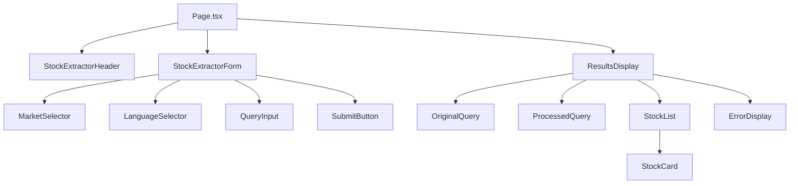

# Stock Ticker Extractor Component Breakdown

## Overview

This document outlines the plan for breaking down the main page.tsx component into smaller, reusable components to improve maintainability, testability, and code organization.

## Component Structure



## Directory Structure

```
src/components/
├── stock-extractor/
│   ├── header/
│   │   └── StockExtractorHeader.tsx
│   ├── form/
│   │   ├── StockExtractorForm.tsx
│   │   ├── MarketSelector.tsx
│   │   ├── LanguageSelector.tsx
│   │   ├── QueryInput.tsx
│   │   └── SubmitButton.tsx
│   └── results/
│       ├── ResultsDisplay.tsx
│       ├── OriginalQuery.tsx
│       ├── ProcessedQuery.tsx
│       ├── StockList.tsx
│       ├── StockCard.tsx
│       └── ErrorDisplay.tsx
```

## Component Details

### 1. StockExtractorHeader
- Simple presentational component
- Displays the application title
- No state management
- Props:
  - title: string

### 2. StockExtractorForm
- Container component for form elements
- Manages form state and submission
- Sub-components:
  - MarketSelector:
    - Handles market location selection
    - Props: value, onChange
    - Persists selection to localStorage
  - LanguageSelector:
    - Handles language selection
    - Props: value, onChange
    - Persists selection to localStorage
  - QueryInput:
    - Textarea with keyboard handling
    - Props: value, onChange, onSubmit
  - SubmitButton:
    - Submit button with loading state
    - Props: isLoading, onClick

### 3. ResultsDisplay
- Container for displaying query results
- Sub-components:
  - OriginalQuery:
    - Displays original input text
    - Props: text
  - ProcessedQuery:
    - Shows processed text
    - Props: text
  - StockList:
    - Grid layout for stock cards
    - Props: stocks
  - ErrorDisplay:
    - Shows error messages
    - Props: error

### 4. StockCard
- Reusable component for stock information
- Pure component with props:
  - symbol: string
  - name: string
  - exchangeShortName: string

## State Management

### Page Level State
```typescript
const [parsedResult, setparsedResult] = useState<ParsedResult | null>(null);
const [isLoading, setIsLoading] = useState(false);
const [error, setError] = useState('');
```

### Form Level State
```typescript
const [userQuery, setUserQuery] = useState('');
const [location, setLocation] = useState("GLOBAL");
const [language, setLanguage] = useState<SupportedLanguage>('en');
```

## Benefits

1. **Improved Code Organization**
   - Clear component hierarchy
   - Logical file structure
   - Better separation of concerns

2. **Enhanced Maintainability**
   - Smaller, focused components
   - Easier to understand and modify
   - Reduced cognitive load

3. **Better Testing**
   - Isolated components
   - Clear responsibilities
   - Easier to write unit tests

4. **Performance Optimization**
   - Component-level updates
   - Reduced re-renders
   - Better memoization opportunities

5. **Reusability**
   - Modular components
   - Consistent styling
   - Shared utilities

## Implementation Strategy

1. Create the component directory structure
2. Move reusable components (StockCard) first
3. Implement form components
4. Create results display components
5. Update page.tsx to use new components
6. Add TypeScript interfaces for props
7. Add unit tests for components

## Next Steps

1. Switch to code mode
2. Create component directory structure
3. Begin implementing components
4. Update main page to use new components